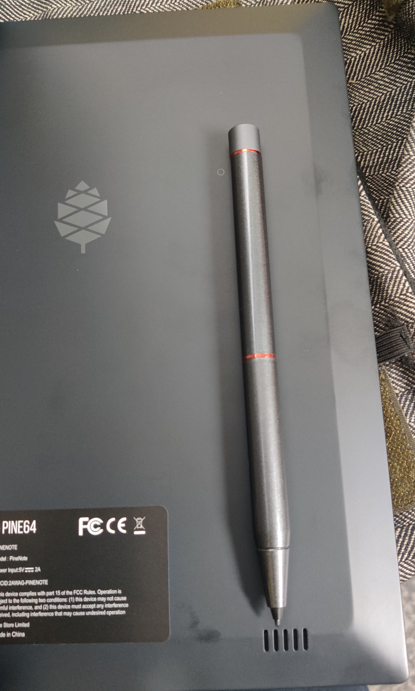
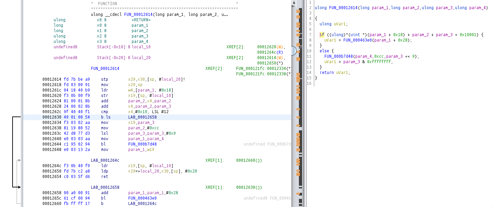

# PineNotes

<!--ts-->
* [Starter Guide](#starter-guide)
   * [Backup partitions](#backup-partitions)
      * [Rkdeveloptool](#rkdeveloptool)
      * [Download mode](#download-mode)
      * [Fix uboot](#fix-uboot)
      * [Backup partitions](#backup-partitions-1)
   * [Android root](#android-root)
      * [Enable ADB](#enable-adb)
      * [Magisk](#magisk)
   * [Build mainline kernel](#build-mainline-kernel)
      * [VCOM](#vcom)
      * [Compile the kernel](#compile-the-kernel)
      * [Export firmware](#export-firmware)
   * [Alpine](#alpine)
      * [Install /cache](#install-cache)
      * [Boot](#boot)
      * [Shrink userdata](#shrink-userdata)
      * [Recreate userdata](#recreate-userdata)
   * [Arch Linux](#arch-linux)
      * [Install](#install)
      * [Boot Arch](#boot-arch)
      * [Setup Arch](#setup-arch)
      * [Install alternative wireless driver](#install-alternative-wireless-driver)
      * [Change Kernel](#change-kernel)
      * [Sway](#sway)
      * [Test input](#test-input)
* [Misc Notes](#misc-notes)
   * [Links](#links)
   * [Building BSP kernel](#building-bsp-kernel)
   * [Building U-Boot](#building-u-boot)
   * [Custom Logo](#custom-logo)
   * [Eink Refresh](#eink-refresh)
   * [Strace](#strace)
   * [Eink](#eink)
   * [Boot from userdata subdirectory](#boot-from-userdata-subdirectory)
   * [Looproot](#looproot)
   * [GPU](#gpu)
   * [Ghidra](#ghidra)

<!-- Added by: dorian, at: Fri Feb  4 06:53:45 PM CET 2022 -->

<!--te-->


# Starter Guide

The goal of this (unofficial) document is to guide you from unboxing to running and developing on (Arch) Linux on your PineNote.

Note that I didn't fully test this document from start to finish.
So make sure you understand each command before you run it.
If you find errata, open issues, or even better, pull requests.

## Backup partitions

See also https://wiki.pine64.org/wiki/PineNote_Development

### Rkdeveloptool

Build rkdeveloptool:
```sh
git clone https://gitlab.com/pine64-org/quartz-bsp/rkdeveloptool.git
cd rkdeveloptool
mkdir build
cd build
cmake ..
```

### Download mode

Enter the download mode by placing the pen as pictured below.
A magnet placed where the pen's cap is should also work (haven't tried).
I guess the dot on the case also indicates the position of the sensor.



lsusb should now recognize the PineNote as
```
2207:350a Fuzhou Rockchip Electronics Company USB download gadget
```

List partitions:
```
> rkdeveloptool list-partitions                      
#   LBA start (sectors)  LBA end (sectors)  Size (bytes)       Name                
00                16384              24575       4194304       uboot
01                24576              32767       4194304       trust
02                32768              36863       2097152       waveform
03                36864              45055       4194304       misc
04                45056              53247       4194304       dtbo
05                53248              55295       1048576       vbmeta
06                55296             137215      41943040       boot
07               137216             145407       4194304       security
08               145408             407551     134217728       recovery
09               407552            1193983     402653184       backup
10              1193984            3291135    1073741824       cache
11              3291136            3323903      16777216       metadata
12              3323904            9697279    3263168512       super
13              9697280            9730047      16777216       logo
14              9730048            9861119      67108864       device
15              9861120          241827775  118766927872       userdata
```

### Fix uboot

Unfortunately, you cannot dump partitions after 32MB ([source](https://gitlab.com/pgwipeout/u-boot-rockchip/-/blob/quartz64/cmd/rockusb.c#L28)), as all bytes are replaced by 0xCC.
```c
if ((blkstart + blkcnt) > RKUSB_READ_LIMIT_ADDR) {
    memset(buf, 0xcc, blkcnt * SECTOR_SIZE);
    return blkcnt;
} else {
    return blk_dread(block_dev, blkstart, blkcnt, buf);
}
```

I provide a [fixed version of uboot](static/uboot_patched.img), which you can flash with:
```sh
rkdeveloptool write-partition uboot uboot_patched.img
```
WARNING: If you corrupt uboot, it may be necessary to open the device to unbrick it!

In the rest of this section, I elaborate on how I created this image.
First, read the uboot partition, which is readable as its below 32M.
```sh
rkdeveloptool read-partition uboot uboot.img
```
From `uboot.img`, extract the `u-boot.bin` (see [uboot_img.py](py/uboot_img.py)).
The offending `rkusb_read_sector` function seen in the below screenshot from ghidra.



We just need to change the `b.ls` to a `b` instruction to always go to the `if` branch.

After modifying the `u-boot.bin` file, we can create a patched `uboot.img` file using the python script.
`uboot.img` appears to consist of two equal parts of size 0x200000 containing a dtb file (`dtc -I dtb -O dts uboot.img`) describing the sections followed by binary data.

```
> radiff2 uboot_factory.img uboot_patched.img 
0x00000190 95773e263e2a17568f8419ca7b9f96d434881e5cd4d0562d51f5c13bde94d7f7 => 3559cd72cd63c1b596ad9daad7d37ea28f68d37b14505e8b6c4fe6ef7f42f2ba 0x00000190
0x00013430 4901 => 0a00 0x00013430
0x00013433 54 => 14 0x00013433
0x00200190 95773e263e2a17568f8419ca7b9f96d434881e5cd4d0562d51f5c13bde94d7f7 => 3559cd72cd63c1b596ad9daad7d37ea28f68d37b14505e8b6c4fe6ef7f42f2ba 0x00200190
0x00213430 4901 => 0a00 0x00213430
0x00213433 54 => 14 0x00213433
```

In the diff, we can see the duplication. The two differences are hash values, the short ones correspond to the patched instruction.

### Backup partitions

After patching uboot, enter download mode again and run

```sh
rkdeveloptool read-partition boot boot.img
# for all partiations except userdata
rkdeveloptool write-partition uboot uboot.img
rkdeveloptool reboot
```

Note that there is a bug in rkdeveloptool that prohibits us from dumping partitions of size larger than 2G.
There exists a [patch](https://github.com/tpwrules/nixos-pinenote/blob/96d2c9158edb9da59afcb952cc864fada18382f9/nix/rkdeveloptool/0001-fix-large-dumps.patch), which I haven't tried.
But userdata is not so important because android can recreate that on its own.
Do make sure that the dumped partitions contain actual data and not just 0xCC.

My backup is [here](https://1drv.ms/u/s!AuBFUYtk7aRLxSpIleR55b3io2a0?e=z9bRea), though the userdata is broken, because I was not aware of the bug in rkdeveloptool at the time.

## Android root

### Enable ADB

https://forum.pine64.org/showthread.php?tid=15598

- Application icon (4 squares) in the top
- Application management
- Application message
- 3 Dots -> Show System
- Search for "Settings" and open

Enable ADB the standard way.
This didn't work immediately for me, so I also set the "Default USB configuration" to PTP, after which I had to reenable ADB.
Then I got the permission prompt.

### Magisk

We use [Magisk](https://github.com/topjohnwu/Magisk) following the [tutorial](https://topjohnwu.github.io/Magisk/install.html#patching-images).

I had issues with Magisk, discussed in this [issue](https://github.com/topjohnwu/Magisk/issues/5125) (many thanks to canyie for fixing this so quickly).
The canary build of Magisk, should work now, but I also backed up the version I used ([backup](static/magisk_c85b2a0.apk)).

```
adb push boot.img /sdcard/boot.img  # make sure that boot.img is not corruped with 0xCC! (d60f4054edb91259fb4471eb5f0ba53803b9a7e2300c3647e11f7b71aa95a003)
adb install magisk_c85b2a0.apk
# install magisk to boot.img
adb pull /sdcard/Download/magisk_patched-23011_dhTkI.img boot_magisk.img
rkdeveloptool write-partition boot boot_magisk.img
rkdeveloptool reboot
```

Now you should have a working root. Try running `su` in `adb shell`.

## Build mainline kernel

Clone kernel:
```sh
git clone -b rk356x-ebc-dev https://github.com/smaeul/linux.git
# or
git clone https://gitlab.com/pgwipeout/linux-next.git
curl https://gitlab.com/pgwipeout/quartz64_ci/-/raw/main/quartz64_defconfig?inline=false -o linux-next/arch/arm64/configs/pinenote_defconfig
```
I'm using pgwipeout's kernel for now.

### VCOM

Each Eink panel has a calibration offset VCOM.
The factory uboot sets the kernel parameter `ebc_pmic.vcom=960`, which you can find out with `cat /proc/cmdline` on android.
For my device, VCOM is 960mV, but this value is (supposedly) unique for each device.
This value should be entered into `regulator-min-microvolt` and `regulator-max-microvolt` in the `rk3556-pinenote.dts`.
Alternatively, you can also remove the `regulator-min-microvolt` and `regulator-max-microvolt`, which we do here.

```diff
--- a/arch/arm64/boot/dts/rockchip/rk3566-pinenote.dts
+++ b/arch/arm64/boot/dts/rockchip/rk3566-pinenote.dts
@@ -653,8 +653,8 @@ v3p3: v3p3 {
 
                        vcom: vcom {
                                regulator-name = "vcom";
-                               regulator-min-microvolt = <1450000>;
-                               regulator-max-microvolt = <1450000>;
+                               /* regulator-min-microvolt = <960000>;
+                               regulator-max-microvolt = <960000>; */
                        };
 
                        vdrive: vdrive {
```

### Compile the kernel

For bluetooth mouse/keyboard, add
```
CONFIG_UHID=m
```

(Optional) Add F2FS to `pinenote_defconfig` such that we can work with the userdata partition.
Note that it seems like mounting userdata causes Android's fsck to report corruption which takes a while to fix on the next boot.
```
CONFIG_F2FS_FS=y
CONFIG_F2FS_STAT_FS=y
CONFIG_F2FS_FS_XATTR=y
CONFIG_F2FS_FS_POSIX_ACL=y
CONFIG_F2FS_FS_SECURITY=y
CONFIG_F2FS_FS_ENCRYPTION=y
```

Download toolchain (next to the kernel directory):
```sh
wget https://developer.arm.com/-/media/Files/downloads/gnu-a/10.3-2021.07/binrel/gcc-arm-10.3-2021.07-x86_64-aarch64-none-linux-gnu.tar.xz{,.asc}
md5sum -c gcc-arm-10.3-2021.07-x86_64-aarch64-none-linux-gnu.tar.xz.asc
tar xfv gcc-arm-10.3-2021.07-x86_64-aarch64-none-linux-gnu.tar.xz
```

Build (save as shell script for rebuilds):

```sh
export CROSS_COMPILE="$PWD/../gcc-arm-10.3-2021.07-x86_64-aarch64-none-linux-gnu/bin/aarch64-none-linux-gnu-"
export ARCH=arm64

make clean

make pinenote_defconfig
make -j $(nproc) all

rm -rf pack
mkdir pack
make INSTALL_MOD_PATH=pack modules_install
make INSTALL_PATH=pack dtbs_install

out=../kout

rm -rf $out
mkdir $out
cp arch/arm64/boot/Image $out
cp pack/dtbs/*/rockchip/rk3566-pinenote.dtb $out
rsync -av pack/lib/modules $out --exclude='*/source' --exclude='*/build'

pushd $out/modules
tar cf ../modules.tar *
rm -r ../modules
popd
```

### Export firmware


```sh
adb shell
su

cd /vendor/etc/firmware
tar -c -j -f /sdcard/firmware.tar.bz2 *
dd if=/dev/block/mmcblk2p3 of=/sdcard/waveform.bin bs=1k count=2048
sha1sum /sdcard/firmware.tar.bz2 /sdcard/waveform.bin
# waveform.bin matches waveform partition
exit

adb pull /sdcard/waveform.bin
adb pull /sdcard/firmware.tar.bz2
```
Backup: (waveform.bin)[static/waveform.bin], (firmware.tar.bz2)[static/firmware.tar.bz2]

## Alpine

Based on: https://musings.martyn.berlin/dual-booting-the-pinenote-with-android-and-debian

### Install /cache

```sh
# alpine rootfs
wget https://dl-cdn.alpinelinux.org/alpine/v3.15/releases/aarch64/alpine-minirootfs-3.15.0-aarch64.tar.gz
adb push alpine-minirootfs-3.15.0-aarch64.tar.gz /sdcard

# kernel and modules
cd kout
adb push * /sdcard

adb shell
su

cp rk3566-pinenote.dtb Image /cache
tar -zxf alpine-minirootfs-3.15.0-aarch64.tar.gz -C /cache
echo "nameserver $(getprop net.dns1)" > /cache/etc/resolv.conf

# chroot to install additional tools  (wake the pinenote to connect to wifi)
env -i PATH=/usr/bin:/bin:/usr/sbin:/sbin chroot /cache
apk add --no-cache parted e2fsprogs
```

Note, at this point we could also install firmware and modules, but we skip that part because I only want to use alpine to modify the partitions.

### Boot

Connect to PineNote via the UART adapter.
```sh
picocom /dev/ttyUSB0 -b 1500000 -l
```

Reboot from android and hold `Ctrl+C` in the picocom terminal until `=> <INTERRUPT>` appears.
Then we have entered the uboot shell.
Copy the following commands to boot into Alpine (you may have to copy them one by one).

```sh
load mmc 0:b ${kernel_addr_r} /Image
load mmc 0:b ${fdt_addr_r} /rk3566-pinenote.dtb
setenv bootargs ignore_loglevel root=/dev/mmcblk0p11 rw rootwait earlycon console=tty0 console=ttyS2,1500000n8 fw_devlink=off init=/bin/sh
booti ${kernel_addr_r} - ${fdt_addr_r}
```

### Shrink userdata

```sh
export TERM=dumb
mount -t proc proc /proc
parted
select /dev/mmcblk0
print
```

You should the the list of partitions now:
```
Number  Start   End     Size    File system  Name      Flags
 1      8389kB  12.6MB  4194kB               uboot
 2      12.6MB  16.8MB  4194kB               trust
 3      16.8MB  18.9MB  2097kB               waveform
 4      18.9MB  23.1MB  4194kB               misc
 5      23.1MB  27.3MB  4194kB               dtbo
 6      27.3MB  28.3MB  1049kB               vbmeta
 7      28.3MB  70.3MB  41.9MB               boot
 8      70.3MB  74.4MB  4194kB               security
 9      74.4MB  209MB   134MB                recovery
10      209MB   611MB   403MB                backup
11      611MB   1685MB  1074MB  ext4         cache
12      1685MB  1702MB  16.8MB  ext4         metadata
13      1702MB  4965MB  3263MB               super
14      4965MB  4982MB  16.8MB               logo
15      4982MB  5049MB  67.1MB  fat16        device
16      5049MB  124GB   119GB   f2fs         userdata
```

Resize userdata to 8G:

```
resizepart 16 13049M
yes
Ignore
print
```

```
15      4982MB  5049MB  67.1MB  fat16        device
16      5049MB  13.0GB  8000MB  f2fs         userdata
```

```
mkpart primary ext4 13G 100%
Ignore
print
```

```
16      5049MB  13.0GB  8000MB  f2fs         userdata
17      13.0GB  124GB   111GB   ext4         primary
```

Reboot:
```
quit
exit
```

### Recreate userdata

By resizing, we have broken the userdata partition.
But we can rebuild it with fastboot.

Enter uboot again with `Ctrl+C` and enter:
```
fastboot usb 0
```
Disconnect the UART adapter and connect the PineNote directly.

```
fastboot erase userdata
fastboot reboot
```

You need to turn the PineNote on again.
This will take a while because it has to recreate its userdata.

Now setup everything again and reinstall magisk (no need to reflash boot).
```
adb install static/magisk_c85b2a0.apk
```
Open magisk and allow it to reboot.

## Arch Linux

### Install

Download:
```sh
wget http://os.archlinuxarm.org/os/ArchLinuxARM-aarch64-latest.tar.gz{,.sig}
gpg --recv-key 68B3537F39A313B3E574D06777193F152BDBE6A6
gpg --verify ArchLinuxARM-aarch64-latest.tar.gz{.sig,}

adb push ArchLinuxARM-aarch64-latest.tar.gz /sdcard
adb push kout/* /sdcard
```

Mount partition:
```sh
mkfs.ext4 /dev/block/mmcblk2p17
mount /dev/block/mmcblk2p17 /mnt/arch/
```

Extract
```sh
tar -x -f /sdcard/ArchLinuxARM-aarch64-latest.tar.gz -C /mnt/arch/

cd /mnt/arch
# arch messes with /boot, so create a different one
mkdir boot2
cp /sdcard/Image /sdcard/rk3566-pinenote.dtb boot2
tar -x -f /sdcard/modules.tar -C lib/modules
chown -R 0:0 lib/modules/5.16*

mv lib/firmware lib/firmware.bak
mkdir lib/firmware
tar -x -f /sdcard/firmware.tar.bz2 -C lib/firmware

cd lib/firmware
cp /sdcard/waveform.bin .
chmod +r waveform.bin
mkdir brcm
cp fw_bcm43455c0_ag_cy.bin brcm/brcmfmac43455-sdio.bin
cp nvram_ap6255_cy.txt brcm/brcmfmac43455-sdio.txt
cp fw_bcm43455c0_ag_cy.bin brcm/brcmfmac43455-sdio.pine64,pinenote.bin
cp nvram_ap6255_cy.txt brcm/brcmfmac43455-sdio.pine64,pinenote.txt
cp BCM4345C0.hcd brcm/BCM4345C0.hcd
```

Chroot to install NetworkManager:
```sh
cd /mnt/arch

mount -t proc /proc proc/
mount --rbind /sys sys/
mount --rbind /dev dev/
mount -t tmpfs tmpfs tmp

rm etc/resolv.conf
# lrwxrwxrwx 1 root root 32 2021-11-20 03:44 etc/resolv.conf -> /run/systemd/resolve/resolv.conf

echo "nameserver $(getprop net.dns1)" > etc/resolv.conf

env -i PATH=/usr/bin:/bin:/usr/sbin:/sbin chroot /mnt/arch bash

cp /boot/initramfs-linux.img /boot2

pacman-key --init
pacman-key --populate archlinuxarm

# uninstall firmware and kernel, which we don't use
pacman -R linux-aarch64  linux-firmware

pacman -Syuu
pacman -S networkmanager

cd boot2
pacman -S uboot-tools
mkimage -A arm -T ramdisk -C none -n uInitrd -d initramfs-linux.img uInitrd.img
```

TODO: generate custom initramfs. This one seems to work, but it doesn't run any hooks like fsck.

### Boot Arch

Back to the uboot shell:
```sh
load mmc 0:11 ${kernel_addr_r} /boot2/Image
load mmc 0:11 ${fdt_addr_r} /boot2/rk3566-pinenote.dtb
load mmc 0:11 ${ramdisk_addr_r} /boot2/uInitrd.img
setenv bootargs ignore_loglevel root=/dev/mmcblk0p17 rw rootwait earlycon console=tty0 console=ttyS2,1500000n8 fw_devlink=off
booti ${kernel_addr_r} ${ramdisk_addr_r} ${fdt_addr_r}
```
Note that `0:11` is in hex, so it refers to `mmcblk0p17`.

To avoid having to paste all these commands, create `/boot2/extlinux.conf`:
```
timeout 10
default MAINLINE
menu title boot prev kernel

label MAINLINE
  kernel /boot2/Image
  fdt /boot2/rk3566-pinenote.dtb
  initrd /boot2/uInitrd.img
  append ignore_loglevel root=/dev/mmcblk0p17 rw rootwait earlycon console=tty0 console=ttyS2,1500000n8 fw_devlink=off
```

If everything boots fine, you can remove the `ignore_loglevel` and then `sudo dmesg -n 1` to disable the log spam or replace it with `loglevel=1`.

Boot with
```sh
sysboot ${devtype} ${devnum}:11 any ${scriptaddr} /boot2/extlinux.conf
```

### Setup Arch

Login with `root:root`

```sh
systemctl enable --now NetworkManager
nmcli device wifi connect <ssid> password <pwd>

systemctl enable --now sshd
```

Now we can finally SSH into the PineNote.

```sh
ssh-copy-id -i ~/.ssh/id_rsa.pub alarm@192.168.178.80
ssh alarm@129.168.178.20
# default password alarm
```

Install larger terminal font:

```sh
pacman -S terminus-font
FONT=ter-124n
echo FONT=ter-124n > /etc/vconsole.conf
```

Allow the video group at access the backlight brightness:
`/etc/udev/rules.d/backlight.rules`
```
RUN+="/bin/chgrp video /sys/class/backlight/backlight_cool/brightness"
RUN+="/bin/chmod g+w /sys/class/backlight/backlight_cool/brightness"

RUN+="/bin/chgrp video /sys/class/backlight/backlight_warm/brightness"
RUN+="/bin/chmod g+w /sys/class/backlight/backlight_warm/brightness"
```

Reload: `sudo udevadm control --reload-rules && sudo udevadm trigger`

Backlight (values from 0 to 255):
```sh
echo 100 > /sys/class/backlight/backlight_warm/brightness
echo 100 > /sys/class/backlight/backlight_cool/brightness
```

Setup `/etc/fstab`:

```
/dev/mmcblk0p17   /         ext4    rw,noatime,nodiscard    0 1
/dev/mmcblk0p11   /cache    ext4    rw,noatime,nodiscard    0 2
```

Enable trim:
```
sudo systemctl enable fstrim.timer
```

Enable bluetooth:
```
pacman -S bluez bluez-utils
systemctl enable bluetooth
```
Set `AutoEnable=true` in `/etc/bluetooth/main.conf`.
To make bluetooth actually work, install the alternative wireless driver and make sure that `CONFIG_UHID=m` is set in the defconfig.

### Install alternative wireless driver

Right now, it takes about 60 seconds until the wlan driver becomes available because it is missing the `/lib/firmware/brcm/brcmfmac43455-sdio.clm_blob` file.
This is due to the `CONFIG_FW_LOADER_USER_HELPER_FALLBACK` option, which gives userspace 60 seconds to provide the missing blob.
You can either disable this option or use the driver from the cypress website ([backup](static/43455/cypress-fmac-v5.4.18-2020_0925.zip)]) which comes with the `clm_blob`.

I also add a different `BCM4345C0.hcd` file ([backup](static/43455/BCM4345C0.hcd)]), which seems to improve wifi speed and bluetooth stability.

```sh
wget https://community.cypress.com/gfawx74859/attachments/gfawx74859/resourcelibrary/1030/1/cypress-fmac-v5.4.18-2020_0925.zip
wget https://github.com/worproject/cywbtserialbus/raw/master/src/vendor/fw/BCM4345C0.hcd

unzip cypress-fmac-v5.4.18-2020_0925.zip cypress-firmware-v5.4.18-2020_0925.tar.gz
tar xzf cypress-firmware-v5.4.18-2020_0925.tar.gz firmware/cyfmac43455-sdio.clm_blob firmware/cyfmac43455-sdio.bin

cd /lib/firmware/brcm
sudo cp brcmfmac43455-sdio.pine64,pinenote.bin brcmfmac43455-sdio.pine64,pinenote.bin.bak
sudo cp /home/alarm/Downloads/firmware/cyfmac43455-sdio.clm_blob brcmfmac43455-sdio.clm_blob
sudo cp /home/alarm/Downloads/firmware/cyfmac43455-sdio.bin brcmfmac43455-sdio.pine64,pinenote.bin

sudo cp BCM4345C0.hcd BCM4345C0.hcd.bak
sudo cp /home/alarm/Downloads/firmware/BCM4345C0.hcd .
```

You can also use the [newer hcd](https://github.com/RPi-Distro/bluez-firmware/raw/master/broadcom/BCM4345C0.hcd) ([backup](static/43455/BCM4345C0_new.hcd)]), which seems a little bit slower, but has a fixed CVE.

### Change Kernel

Right now, [smaeul's kernel](https://github.com/smaeul/linux/commits/rk356x-ebc-dev) has working USB, which pgwipeout does not yet have, but no working touch.
Though there may be more differences.
You can build the kernel using the same build script as above and copy the files using scp.
The following code can be added to the build script.

```sh
con=alarm@192.168.178.80
boot=/boot

ssh $con rm -r kout
scp -r $out $con:kout
ssh $con "cd kout; sudo cp rk3566-pinenote.dtb Image $boot; sudo tar xfv modules.tar -C /lib/modules; sudo chown -R 0:0 /lib/modules"
```

Note: if both kernels have the same uname (root directory in `modules.tar`), then you need to change name, as generally modules from different kernel builds are not compatiable.

```sh
sysboot ${devtype} ${devnum}:11 any ${scriptaddr} /boot/extlinux.conf
```


### Sway

```
sudo pacman -S sway
```

Add to `.bash_profile` (GPU doesn't work yet):
```sh
export LIBGL_ALWAYS_SOFTWARE=true
export GALLIUM_DRIVER=llvmpipe
export WLR_RENDERER_ALLOW_SOFTWARE=1
```

You can now start sway.
For that, you have to log in on the main screen using a keyboard (not over serial).

If the ghosting gets too bad, force refresh:
```sh
echo 1 | sudo tee /sys/module/rockchip_ebc/parameters/force_refresh
```

You can also change the LUT using
```sh
echo 7 | sudo tee /sys/module/rockchip_ebc/parameters/lut_type
```
7 is the default waveform GC16 (see `drivers/gpu/drm/rockchip/pvi_waveform.h`)
4 is GRAY2, which only seems to white to black changes, but very quickly.

Config:
```
mkdir .config/sway
cp ~/.config/sway/config
```
Change options:
```
output * bg #FFFFFF solid_color
```
(TODO)


### Test input

```sh
libinput debug-events
# or
evtest /dev/input/event6
```

# Misc Notes

## Links

- Reimplementation of Rockchip E-Ink waveform/LUT code: https://gitlab.com/smaeul/ebc-dev/-/tree/main
- hwcomposer (android component that communicates with the ebc driver): https://github.com/TinkerBoard-Android/hardware-rockchip-hwcomposer-einkhwc
- downstream linux: https://toscode.gitee.com/caesar-wang/ohos-kernel-4.19
- smaeul's repo, current driver is 2.08 (BSP has 1.04): https://github.com/smaeul/linux/commits/rk356x-ebc-dev/drivers/gpu/drm/rockchip/ebc-dev
- pwarren's partition backup: https://pwarren.id.au/pinenote/partitions/
- latest BSP U-Boot: https://toscode.gitee.com/caesar-wang/u-boot / https://github.com/Caesar-github/u-boot / https://github.com/JeffyCN/rockchip_mirrors/tree/u-boot
  - installed version: U-Boot 2017.09-g966d3c1 (aarch64-linux-gnu-gcc (Linaro GCC 6.3-2017.05) 6.3.1 20170404; GNU ld (Linaro_Binutils-2017.05) 2.27.0.20161019)
    - this commit is not in any repo???
  - earlier version: U-Boot 2017.09-gead987b #chichengzao (Aug 23 2021 - 16:15:18 +0800)
- neural network toolkit:
  - https://wiki.t-firefly.com/en/ROC-RK3566-PC/usage_npu.html
  - https://github.com/rockchip-linux/rknn-toolkit2/blob/master/doc/Rockchip_User_Guide_RKNN_Toolkit2_EN-1.1.0.pdf 
- Documentation about eink refresh modes: https://www.waveshare.net/w/upload/c/c4/E-paper-mode-declaration.pdf
- Example program to interact directly with eink: https://puck.moe/up/bomit-posoh.c
- https://musings.martyn.berlin/dual-booting-the-pinenote-with-android-and-debian
- https://musings.martyn.berlin/rooting-the-pinenote-factory-android
- https://musings.martyn.berlin/cross-compiling-the-linux-kernel-for-the-pinenote-or-other-arm-device
- Smaeul's extlinux.conf: `sysboot mmc 0:b any ${scriptaddr} /boot/extlinux.conf`
	```
	timeout 0
	default MAINLINE

	label MAINLINE
		kernel /boot/Image
		fdt /boot/rk3566-pinenote.dtb
		append drm.debug=0x0 ignore_loglevel init=/etc/rc/init no_console_suspend root=/dev/mmcblk0p11 rootwait vt.color=0xf
	```
- https://gitlab.com/pgwipeout/quartz64_ci
- https://gitlab.com/pgwipeout/u-boot-rockchip
- https://gitlab.com/pgwipeout/linux-next/-/commit/c8bc9650b35bc3c90f606ae5991992927194524b
- Simple sketch app that draws directly to the framebuffer: https://puck.moe/git/drawy
- Reverse engineering of assembly ebc driver: https://github.com/Ralim/ebc-dev-reverse-engineering
- Reimplementation of ebc driver: https://gitlab.com/smaeul/ebc-dev
- Nixos instructions (include patch for rkdeveloptool): https://github.com/tpwrules/nixos-pinenote
- Static build util-linux for the pinenote initrd: https://gist.github.com/llandsmeer/0ae6c4ac3d4685ae2c35a05409b71f38
- Latest downstream driver https://github.com/JeffyCN/mirrors/tree/kernel-4.19/drivers/gpu/drm/rockchip/ebc-dev
- Datasheet: https://github.com/Poco-Ye/rk-datasheet/tree/master/356x
- Eink hwcomposer (talks to ebc): https://github.com/TinkerBoard-Android/hardware-rockchip-hwcomposer-einkhwc (alternative: https://gitee.com/mirrors_TinkerBoard2-Android/hardware-rockchip-hwcomposer-einkhwc)
  - outdated compared to downstream driver (I think versions should match)
- uboot eink driver: https://github.com/JeffyCN/mirrors/tree/u-boot/drivers/video/rk_eink
## Building BSP kernel

In Ubuntu 18.04 Docker with packages `repo git ssh make gcc libssl-dev liblz4-tool expect g++ patchelf chrpath gawk texinfo chrpath diffstat binfmt-support qemu-user-static live-build bison flex fakeroot cmake gcc-multilib g++-multilib unzip device-tree-compiler python-pip ncurses-dev python-pyelftools bc time rsync`.

I think the closest device to the pinenote is 
```
./build.sh device/rockchip/rk356x/BoardConfig-rk3566-evb2-lp4x-v10.mk kernel
```
You can edit the `.mk` to increase the number of build threads.
To use the eink, we probably need to edit the dts to include `rk3566-evb2-lp4x-v10-eink.dts`, which is currently seems unused?

## Building U-Boot

In Ubuntu 18.04 Docker with packages `gcc-aarch64-linux-gnu make gcc python3-pyelftools bc`.
```
export CROSS_COMPILE=aarch64-linux-gnu-
make rk3566-quartz64_defconfig
./make.sh
```

## Custom Logo

The PineNote has a `logo` partition containing images displayed by uboot for when the device is off.
There exists a tool called `bmp2gray.c` in the downstream uboot, but it does not appear to quite match the partition.
So I wrote my own [logotool](logodump/logotool.c) to convert the logo partition to PNGs and back.
While I haven't created custom logos, the logotool is able to recreate the logo partition exactly (see the [test.sh](logodump/test.sh) script).


## Eink Refresh

I was curious how the refresh is done (refresh button in the android apps).
I decompiled the com.xrz.ebook app, which is not obfuscated.
The reader appears to be a modified version of [FBreader](https://fbreader.org/) with added function for annotating and eink refresh.
It sets flush modes (in BSP source) by calling the `EinkService` with the following modes:
```
HD mode:             GL:      7
Normal mode:         A2:     15
Extreme speed mode:  Du:     13
Regal mode:          Regal:  10
```

The actual enum in `ebc_dev.h` from Android BSP:
```c
enum panel_refresh_mode {
	EPD_AUTO		= 0,
	EPD_OVERLAY		= 1,
	EPD_FULL_GC16		= 2,
	EPD_FULL_GL16		= 3,
	EPD_FULL_GLR16		= 4,
	EPD_FULL_GLD16		= 5,
	EPD_FULL_GCC16		= 6,
	EPD_PART_GC16		= 7,
	EPD_PART_GL16		= 8,
	EPD_PART_GLR16		= 9,
	EPD_PART_GLD16		= 10,
	EPD_PART_GCC16		= 11,
	EPD_A2			= 12,
	EPD_DU			= 13,
	EPD_RESET		= 14,
	EPD_SUSPEND		= 15,
	EPD_RESUME		= 16,
	EPD_POWER_OFF		= 17,
	EPD_PART_EINK		= 18,
	EPD_FULL_EINK		= 19,
};
```

Current version [2.08](https://github.com/smaeul/linux/blob/26a761b44caa31fa36774686f27e68e0da3bacc0/drivers/gpu/drm/rockchip/ebc-dev/ebc_dev.h) is
```c
enum panel_refresh_mode {
	EPD_AUTO		= 0,
	EPD_OVERLAY		= 1,
	EPD_FULL_GC16		= 2,
	EPD_FULL_GL16		= 3,
	EPD_FULL_GLR16		= 4,
	EPD_FULL_GLD16		= 5,
	EPD_FULL_GCC16		= 6,
	EPD_PART_GC16		= 7,
	EPD_PART_GL16		= 8,
	EPD_PART_GLR16		= 9,
	EPD_PART_GLD16		= 10,
	EPD_PART_GCC16		= 11,
	EPD_A2			= 12,
	EPD_A2_DITHER	        = 13,
	EPD_DU			= 14,
	EPD_DU4			= 15,
	EPD_A2_ENTER		= 16,
	EPD_RESET		= 17,
	EPD_SUSPEND		= 18,
	EPD_RESUME		= 19,
	EPD_POWER_OFF		= 20,
	EPD_FORCE_FULL		= 21,
};
```
These values are also replicated in the custom [`hwcomposer.cpp`](https://github.com/TinkerBoard-Android/hardware-rockchip-hwcomposer-einkhwc/blob/HEAD/hwcomposer.cpp#L142).

## Strace

To see the communication with the eink driver, one can use strace.
Copy [strace](https://github.com/ipduh/strace/tree/master/binaries/arm64/26) to `/cache` and then run `/cache/strace -f -p 205`, where `205` is the PID of `android.hardware.graphics.composer@2.1-service` (use `ps -A` to find the PID).
However, it seems like to actually see the full communication data, we would need to patch strace to dereference pointer parameters for the `ioctl` syscalls.

## Eink

The `ebc-dev` driver logs some information.
```
[28380.255116] ebc-dev ebc-dev: frame start, mode = 7, framecount = 46
```
Here the mode corresponds to the `panel_refresh_mode` enum listed above.
From that, we can tell that in the ebook reader,
"HD mode" is `EPD_PART_GC16`, "Normal mode" is `EPD_DU4`, and "Speed mode" is   `EPD_A2_ENTER` then `EPD_A2_DITHER`.
The browser just uses `PART_GC16` and `FORCE_FULL`.

I'm not sure if the regal mode works.
It is disabled in the ebook reader: There is a class DeviceInfo with a property devicePanelType which is set to 0. If it is 0, then the regal mode button is hidden.

Release [2.11](https://github.com/smaeul/linux/commit/1803804eb0be1e578bff94b9523c79df59ee1392#diff-8df0008fd48942d36076fa34a23a2333cc74718070222ae5f8d7fab5e97301dd) references regal mode in its commit message: "register /dev/waveform for hwc with eink regal lib"

```
[M] <smaeul> the only difference between FULL_G16 and PART_G16 is whether the kernel driver does the waveform lookup for each pixel, or if it directly sends zeroes for unchanged pixels
[I] <semiotics> smaeul: afaiui, GLR16 and GLD16 are supposed to be regal things - you are supposed to preprocess the buffer to use grayscale values 29 and 31 for certain white-white transitions, and then it applies special SGU and ghost-reduction waveforms to those pixels. so PART_GLR16/PART_GLD16 seem a bit contradictory (although I guess it still has some effect in 29->29 and 31->31 transitions...)
[M] <smaeul> also the BSP kernel driver does damage/frame tracking on linear 1x16 groups of pixels... it would be interesting to see if we could use some 4x4 tiled pixel format
[M] <smaeul> OVERLAY is the same as AUTO, except that OVERLAY does framebuffer &= background before the LUT lookup
```

## Boot from userdata subdirectory
    
NOTE: This is how I initially installed linux, but mounting the F2FS partition from linux made Android's fsck report corruption.
Thus, I switched to using a separate partition.
I suppose if you really need more space in android, you could mount the new partition in android.

From android, extract the rootfs to `/data/os/arch`.

Add hook to mount subdirectory has root (https://bbs.archlinux.org/viewtopic.php?pid=932362#p932362):
```sh
cp hooks/{udev,dir}  # preserve permissions
```
Replace code in `hooks/dir` with
```sh
run_hook() {
    echo "Root FS is in: $dir"
    
    dir_pre_mount_handler="$mount_handler"
    mount_handler=dir_mount_handler
}

dir_mount_handler() {
    $dir_pre_mount_handler "$1"
    mount --bind "$1/$dir" "$1"
}
```
Add `dir` hook to `CONFIG`:
```
HOOKS="dir udev"
```
Later we can add `dir=os/arch` as kernel parameter to choose the directly containing root.

Repack initramfs:
```sh
find . | cpio -H newc -o -R root:root | gzip -9 > ../out/initramfs_dir.img
cd ../out
mkimage -A arm -T ramdisk -C none -n uInitrd -d initramfs_dir.img uInitrd.img
```

## Looproot

By ssgelm in discord

```
default l0
menu title U-Boot menu
prompt 0
timeout 0


label l0
        menu label Debian GNU/Linux sid 5.16.0-rc8-dirty
        linux /vmlinuz-5.16.0-rc8-dirty
        fdt /rk3566-pinenote.dtb
        append initrd=/uinitrd rw root=/dev/loop0 looproot=/dev/mmcblk0p16 loop=/media/0/debian.img earlycon console=tty0 console=ttyS2,1500000n8 fw_devlink=off
```

Correction(?) by Danct12
```
        menu label Debian GNU/Linux sid 5.16.0-rc8-dirty
        linux /vmlinuz-5.16.0-rc8-dirty
        initrd /uinitrd
        fdt /rk3566-pinenote.dtb
```

```
root@pinenote:~# cat /etc/initramfs-tools/scripts/init-top/loopboot
#!/bin/sh

PREREQ=""
prereqs()
{
    echo "$PREREQ"
}
case $1 in
# get pre-requisites
prereqs)
    prereqs
    exit 0
    ;;
esac

[ -d ${rootmnt}2 ] || mkdir --mode=0700 ${rootmnt}2
root@pinenote:~# cat /etc/initramfs-tools/scripts/local-premount/loopboot
#!/bin/sh

PREREQ=""
prereqs()
{
    echo "$PREREQ"
}
case $1 in
# get pre-requisites
prereqs)
    prereqs
    exit 0
    ;;
esac

mount -n -t f2fs -o nodiratime,noatime ${looproot} ${rootmnt}2

mknod -m660 /dev/loop0 b 7 0
losetup /dev/loop0 ${rootmnt}2${loop}
```


## GPU

Based on @irrenhause in discord. I haven't tried any of this myself yet.
To enable the GPU, add

```
&gpu {
       mali-supply = <&vdd_gpu_npu>;
       status = "okay";
};
```
to `rk3566-pinenote.dts` above `&i2c0`.
Then
```
[drm] Initialized panfrost 1.2.0 20180908 for fde60000.gpu on minor 0
```
Should appear in the log.
However, actually using the GPU will not work,
```
rockchip-pm-domain fdd90000.power-management:power-controller: failed to get ack on domain 'gpu', val=0x1fe
```
as the factory uboot disables power.
Using downstream uboot as described in the wiki should work with the below patch, but that can't boot android.
```diff
diff --git a/arch/arm/mach-rockchip/rk3568/rk3568.c b/arch/arm/mach-rockchip/rk3568/rk3568.c
index 78d309e8a2..cfae6f386e 100644
--- a/arch/arm/mach-rockchip/rk3568/rk3568.c
+++ b/arch/arm/mach-rockchip/rk3568/rk3568.c
@@ -782,7 +782,7 @@ static void qos_priority_init(void)
 	u32 delay;
 
 	/* enable all pd except npu and gpu */
-	writel(0xffff0000 & ~(BIT(0 + 16) | BIT(1 + 16)),
+	writel(0xffff0000,
 	       PMU_BASE_ADDR + PMU_PWR_GATE_SFTCON);
 	delay = 1000;
 	do {
@@ -795,7 +795,7 @@ static void qos_priority_init(void)
 	} while (readl(PMU_BASE_ADDR + PMU_PWR_DWN_ST) & ~(BIT(0) | BIT(1)));
 
 	/* release all idle request except npu and gpu */
-	writel(0xffff0000 & ~(BIT(1 + 16) | BIT(2 + 16)),
+	writel(0xffff0000,
 	       PMU_BASE_ADDR + PMU_BUS_IDLE_SFTCON0);
 
 	delay = 1000;
diff --git a/lib/avb/libavb/avb_slot_verify.c b/lib/avb/libavb/avb_slot_verify.c
index 123701fc3b..64a1ce6450 100644
--- a/lib/avb/libavb/avb_slot_verify.c
+++ b/lib/avb/libavb/avb_slot_verify.c
@@ -296,7 +296,7 @@ static AvbSlotVerifyResult load_and_verify_hash_partition(
   bool image_preloaded = false;
   uint8_t* digest;
   size_t digest_len;
-  const char* found;
+  const char* found = NULL;
   uint64_t image_size;
   size_t expected_digest_len = 0;
   uint8_t expected_digest_buf[AVB_SHA512_DIGEST_SIZE];
```
But this patch can also be applied to the uboot from thee android BSP.

You might have to unblank the framebuffer to get output (or IOCTL FBIOBLANK):
```
printf 0 > /sys/class/graphics/fb0/blank
```
Starting and stopping XFCE also seems to work.

Note that the GPU is not attached to the EINK, so some copying will be necessary to use the GPU. Maybe the RGA can be used for that?

## Ghidra

https://github.com/Ralim/ebc-dev-reverse-engineering/issues/2

>Here's a suggestion for anyone wanting to look at the pre-compiled files in Ghidra. This is most useful if you haven't already made a bunch of annotations; I don't know how to copy those over. So it's not really aimed at this repo, per se, but here's where the action seems to be.
>
>1. Run `make ARCH=arm64 rockchip_linux_defconfig` to start with a kernel config that builds the EBC driver.
>2. Run `make ARCH=arm64 nconfig` and enable `CONFIG_DEBUG_INFO_DWARF4` (at "Kernel hacking" -> "Compile-time checks and compiler options" -> "Generate dwarf4 debuginfo"). DWARF4 is the newest debug info format that Ghidra understands, but recent GCC will generate DWARF5 by default.
>3. Run `make ARCH=arm64` to compile the kernel. If it fails, that is fine, as long as `drivers/gpu/drm/rockchip/ebc-dev/built-in.a` gets created.
>4. Finally, take the archive containing the EBC driver, and convert it to an object file: `aarch64-linux-gnu-ld -r -o drivers/gpu/drm/rockchip/ebc-dev/built-in.o --whole-archive drivers/gpu/drm/rockchip/ebc-dev/built-in.a`.
> 
>This will create a single file, built-in.o, that includes all of the C and pre-compiled source for the driver, so everything gets loaded together in one code browser, and you don't have to worry about function imports and thunks and whatnot.

```sh
export CROSS_COMPILE="$PWD/../gcc-arm-10.3-2021.07-x86_64-aarch64-none-linux-gnu/bin/aarch64-none-linux-gnu-"
export ARCH=arm64
make rockchip_linux_defconfig
```
Enable Dwarf4 and EBC. Add to `.config`:
```conf
CONFIG_ROCKCHIP_EBC_DEV=y
CONFIG_EPD_TPS65185_SENSOR=y
CONFIG_DEBUG_INFO_DWARF4=y
```
Or use the GUI:
```sh
make nconfig
# "Kernel hacking" -> "Compile-time checks and compiler options" -> "Generate dwarf4 debuginfo"
# "Device Drivers" -> "Graphics support" -> "DRM Support for Rockchip" -> "Rockchip eBook Device Driver"
```
Compile:
```sh
make -j$(nproc)
${CROSS_COMPILE}ld -r -o drivers/gpu/drm/rockchip/ebc-dev/built-in.o --whole-archive drivers/gpu/drm/rockchip/ebc-dev/built-in.a
```
Now you can import the `built-in.o` file into ghidra.
I got an error of the form
```
Low-level Error: Size too small for fields of structure dentry_operations.conflict
```
in the decompiler window.
To fix this, go into the offending struct (here `dentry_operations.conflict`) and change the type of mismatched size (pick any type of the correct size).
Ghidra points out which field has the wrong type in the "mnemonic" column.

Changes:
- Set type of `ebc_buf_s.buf_mode` to `panel_refresh_mode`
- Set type of `pvi_wf_modes` to `pvi_wf_mode[9]`
- Remove the `FUN_*` functions. They are created because Ghidra is confused by the NOPs (`1f2003d5`) created by the Linux kernel for tracing.

([decompiled](rev/ebc_dev_2.26.c))